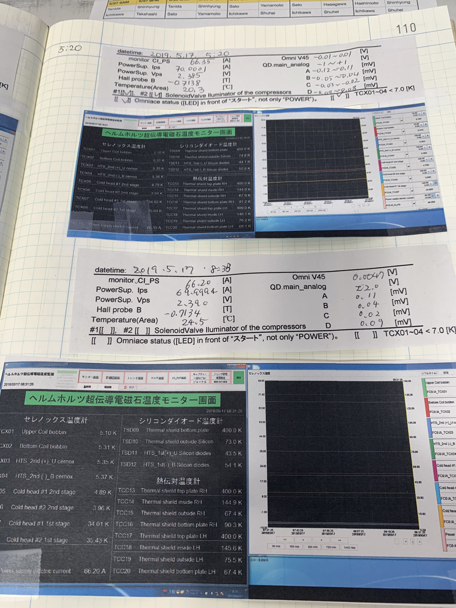

# Shift manual for the magnetic field mapping (2019.05.20)
<div style="text-align: right;">
Shuhei Hayakawa
</div>


## Launch controller

Use jhterm1 (CentOS7 is installed in Mac-Pro) for the field mapping at ERL. Launch the controller at the work directory.

```
[jh@jhterm1 ~]$ cd ~/work/magfield
[jh@jhterm1 magfield]$ ./controller.py
```

The following GUI is launched. Top three labels indicate DAQ status, Mover controller status, and Hall probe controller status. Servo ON/OFF and Inching Up/Dw buttons are normally not used.


Run the progress monitor. It automatically updates.

```
[jh@jhterm1 magfield]$ ./progress.py
```

This shows not the field value but the progress.


## Mapping process

1. Move to the next position. MVC status becomes MOVING.
2. Wait until the field deviation become small (while HPC status is DEVIATE).
   - Bx, By : stddev/mean < 0.6% (when B < 1 mT, not care)
   - Bz : stddev/mean < 0.06%
3. Save data, and repeat 1—3.

It takes 6 seconds to process one step. The current parameter has totally 123,390 steps, which corresponds to 8.5 days.

Since the step parameter is not perfectly ordered in the shortest distance, it is possible to take long time to move to the next position on the edge part.


## Shift work

- See the step progress. Nothing special to do.
- Print out a desktop screenshot of the Windows PC. Write the magnet status sheet. Do this every 3 hours.

- Check the hall probe position at the magnet center every day (Experts do).
  - Stop DAQ, and memo the step number.
  - Push "Go to center" in Control tab. Move to the center position.
  - Check the hall probe position with the laser by eyes.
  - __Reduce the step number by 60__ 
  - Start DAQ
- If you start/stop DAQ with some reason, log the time, the reason, and the step number. Remember to memo and reduce the step number.



Left shows the magnet log. Right shows the probe position before starting shift.


## Troubleshooting

- __DAQ Alarm sounds__

  - Log the error message and take a screenshot.

  - Check the alarm number. See the alarm list to push "Alarm list" in Control tab.     

  - If the mover position exceeds the software limitation, the alarm sounds without any alarm number. In this case, just start DAQ after __reducing the step number by 60__. If the start button is disabled, move to center once.

  - If some alarm number is displayed, push "Alarm reset" in Control tab. Push "Servo ON". Start DAQ after reducing the step number.

  - If the alarm can not be reset, or DAQ can not start, call experts.

- __Too much long waiting time__

  - If the waiting time for the field deviation is too long (for example, more than a minute), something is wrong.
  - Call experts.

- __Other error : controller freezing, communication error, ...__

  - Log the error message and take a screenshot. The error might be displayed not on the controller but in the terminal.
  - Close the controller window and restart controller.py.
  - If it does not recover, call experts.


If you do not know well in any cases, feel free to call experts.

About the magnet operation, follow the magnet manual.


## Others

- Develop mode

  Do not use this mode.

- Free DAQ mode

  When the check button "Free DAQ mode" in Control tab is on, you can start DAQ without mover stepping. In this mode, the deviation check is off.